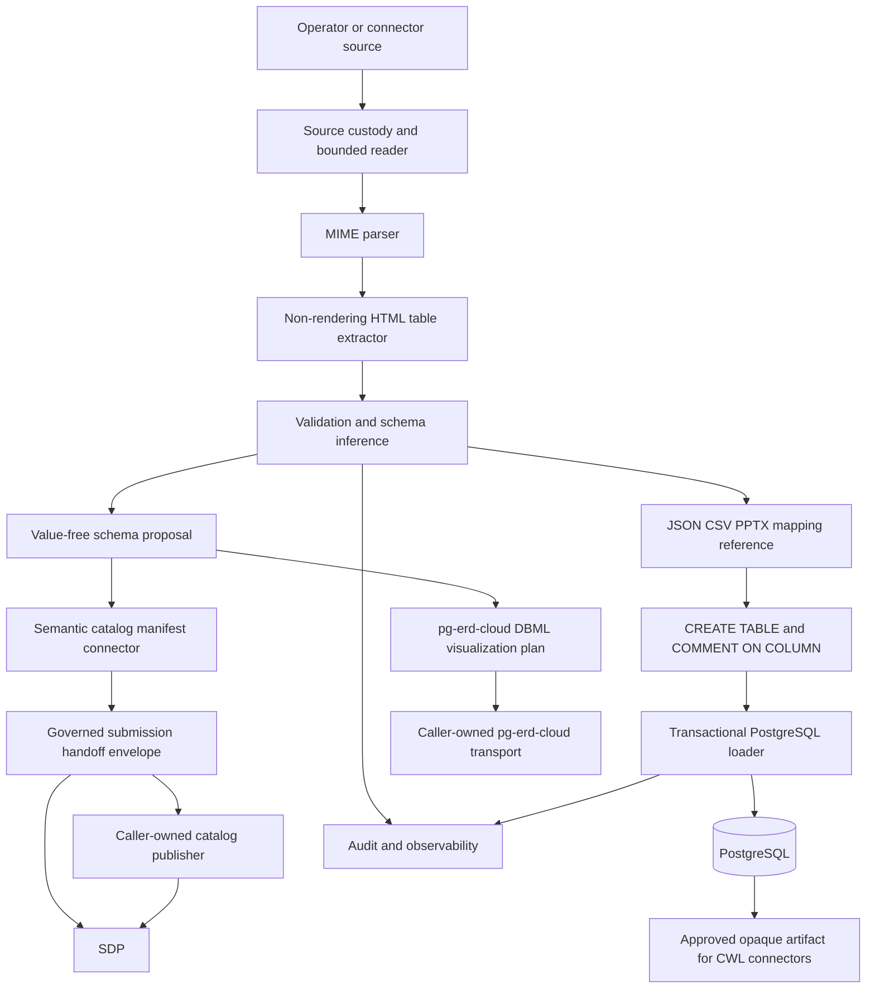
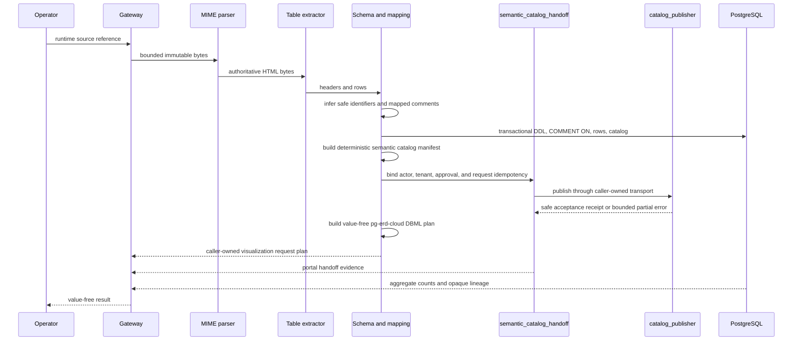
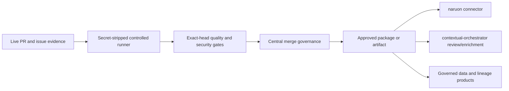

# MHTML ETL Gateway Architecture v0.3

## System context

The gateway is a modular boundary: deterministic parsing and inspection can run
alone, while schema governance and PostgreSQL loading consume approved,
versioned artifacts.

## Module responsibilities

| Module | Responsibility | Boundary |
|---|---|---|
| `source_reader` | one-read, size-capped source intake | local custody only |
| `mime_parser` | RFC 2387 root selection and strict decoding | no rendering or egress |
| `html_tables` / `html_table_extractor` | bounded, deterministic table extraction | inert active content |
| `inspection` | value-free structural evidence | no data values |
| `validation_engine` | required headers and row-shape contracts | fail closed |
| `schema_inference` / `schema_proposal` | safe types and versioned proposals | approval boundary |
| `pipeline.propose_schema_from_mhtml` / `cli propose` | protected local table-to-proposal boundary | caller custody, approval, and export |
| `semantic_catalog_connector` | value-free dataset/column graph manifest | no network or approval bypass |
| `semantic_catalog_handoff` | actor/tenant/approval-bound request plan and idempotency keys | no credentials or transport |
| `semantic_catalog_publisher` | one-shot caller-owned transport and bounded remote-acceptance receipt | no auth, retry, persistence, or source values |
| `pg_erd_connector` | value-free one-table DBML visualization request plan | no network, authentication, persistence, records, or guessed relationships |
| `column_mapping` | JSON/CSV/PPTX text-layer mapping | explicit comments only |
| `postgres_loader` | DDL, comments, streamed rows, catalog, lineage | scoped database DSN |
| `batch` / `pipeline` | single-file and multi-file orchestration | opaque reporting |
| `cli` | inspect, load, and batch commands | fixed errors and summaries |
| `scripts/hourly_product_gap` | guarded development-loop evidence | central workflow authority |

## Data flow

## Privacy and lineage

Raw bytes and cell values remain in the operator-controlled source-custody
boundary. Public reports, errors, logs, and batch summaries exclude row values,
header values, local paths, filenames, raw Content-Location, Content-ID,
credentials, and payloads. Every loaded row carries an immutable SHA-256 and an
opaque `artifact:<sha-prefix>` reference. PII protection uses access control,
encryption, tenant isolation, retention, export authorization, and audit rather
than destructive default masking.

## Database and schema governance

All database objects use at least two-word lowercase `snake_case` names. The
inference layer adds `_field` or `_table` to single-token inputs, reserves the
suffix within PostgreSQL's 63-byte limit, and the SQL boundary rejects unsafe
direct names. The loader creates lineage columns alongside business columns
and applies `COMMENT ON COLUMN` from an explicit mapping reference in the same
setup transaction. A constant compatibility migration renames the legacy
catalog `status` column to `load_status_code`; no caller value is interpolated.
A later artifact can trigger safe type promotion to `TEXT`; incompatible live
types are detected before insertion. Validated typed rows now cross the live
Psycopg sink through `COPY FROM STDIN` in the same transaction as the catalog
upsert. Rejection quarantine, staging schemas, and accepted/rejected
reconciliation remain separate future controls. Schema proposals are versioned
and must be approved before a future service exposes them outside the
source-custody boundary.

## Resource and failure model

Positive budgets cover source bytes, MIME entities and depth, decoded HTML,
tables, rows, columns, raw cells, projected cells, normalized cells, and cell
text. Parsing never follows active content, renders a browser, executes
JavaScript, resolves XML entities, or fetches external resources. Ambiguous MIME
roots, malformed spans, inconsistent rows, exhausted budgets, unsafe identifiers,
and failed reconciliation fail closed with fixed non-reflecting diagnostics.

## Control plane and ecosystem

Connectors consume approved opaque artifacts and cannot alter deterministic
source evidence or bypass validation. The central `.github` workflows retain
approval, rerun, merge, release, and credential authority. Local loops may
prepare fixes and evidence but must not synthesize approvals or weaken gates.

The semantic catalog connector emits request-compatible nodes and edges for
`ContextualWisdomLab/semantic-data-portal` but performs no HTTP request. The
handoff module makes actor identity, tenant reference, approval reference, and
tenant- and approval-scoped per-request idempotency explicit while a
caller-owned authenticated boundary still supplies actor authentication, tenant
authorization, approval verification, credentials, retry, TLS, trace
propagation, and immutable audit controls. The publisher sends each validated
request once and emits a value-free receipt only for explicit 2xx acceptance
with an opaque remote request ID. This preserves standalone operation while
providing a direct MSA seam for governed catalog discovery and reconciliation.
The pg-erd connector is a parallel design-review seam: it emits only a DBML
conversion plan for the proposed table and never calls the visualization
service. Relationship and lineage edges require a later reviewed contract.

## Deployment modes

1. **Embedded library:** callers own source authorization and custody.
2. **Single-node service:** an authenticated API and worker share encrypted
   object storage and PostgreSQL inside a controlled boundary.
3. **MSA:** intake, parser, schema governance, loader, audit, and connector
   services exchange signed, versioned, opaque artifacts.

Only the loader receives scoped database credentials. The parser has no network
egress. All modes retain the same deterministic parser and lineage contracts.

## Assurance

The architecture is designed for NIST SSDF, OWASP ASVS, ISO/IEC 27001, CSAP
readiness, SOC 2 Trust Services Criteria, OpenTelemetry observability, SPDX/SLSA
provenance, and current RFC 2387/RFC 2557 MIME behavior. These are design and
evidence targets, not certification claims. See the [compliance map](COMPLIANCE_CONTROL_MAP.md),
[threat model](THREAT_MODEL.md), [operability guide](OPERABILITY.md), and
[APA 7th references](doctoring/REFERENCES.md).
