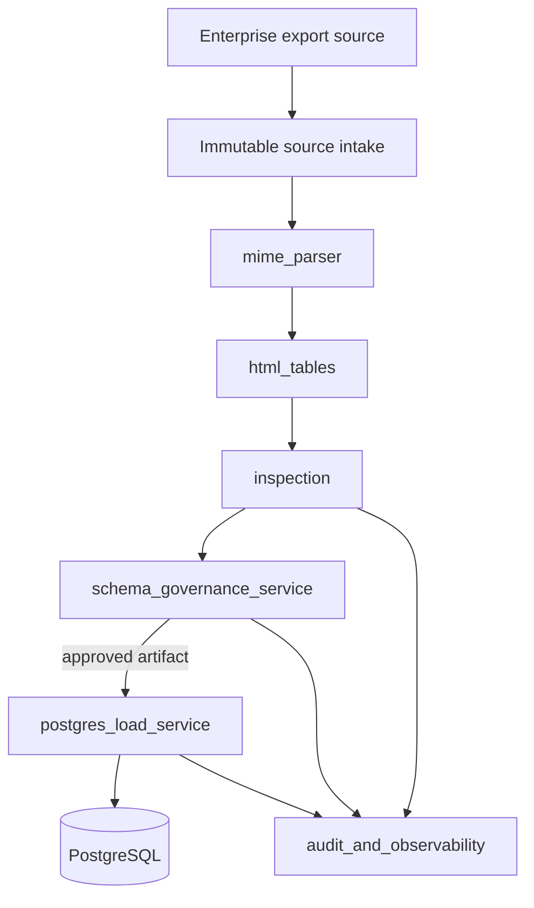
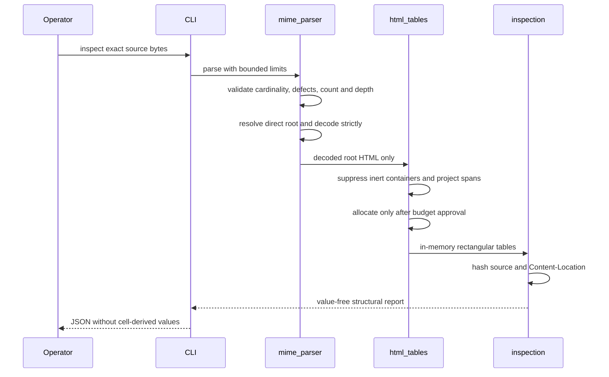
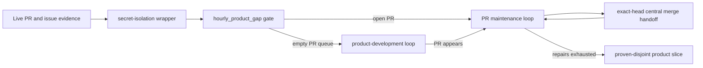

# Architecture

## System context

MHTML ETL Gateway is a modular ingestion boundary. The current package is a standalone deterministic inspector. Future services consume its immutable structural evidence rather than re-parsing untrusted bytes independently.

Nodes shown after `inspection` are future product boundaries. They are not current package capabilities.

## Current package modules

| Module | Responsibility | Side effects |
|---|---|---|
| `errors` | stable fail-closed codes and fixed public messages | none |
| `models` | immutable parser/report contracts and resource budgets | none |
| `mime_parser` | MIME validation, RFC 2387 root selection, bounded strict decoding | file read only through file wrapper |
| `html_tables` | non-rendering table extraction, inert-content handling, span projection and normalization | none |
| `inspection` | source/location hashing and value-free table summaries | none |
| `cli` | local JSON interface | stdout/stderr only |
| `hourly_product_gap` | deterministic GitHub queue and exact-head lease gate | evidence file reads and outputs |

## Deterministic data flow

## Privacy architecture

Raw MHTML and cell values stay inside the caller's protected source-custody boundary. The public inspection artifact contains exact source identity, byte size, hashed location identity when present, table dimensions, header coordinate/source/count metadata, and fixed diagnostics. It omits header/data values, decoded HTML, raw Content-ID and Content-Location, location scheme, source-controlled media type, charset, transfer encoding, paths, and resource payloads.

There is no public header-value opt-in. Future schema governance must introduce a separate authenticated and audited protected artifact instead of widening `InspectionReport`.

## Resource architecture

The parser applies independent positive budgets to:

- source bytes;
- total MIME body entities, including multipart containers;
- MIME nesting depth;
- decoded HTML characters;
- table count;
- rows per table;
- columns per table;
- raw source-cell construction;
- projected and realized normalized cells;
- source cell text.

MIME traversal after parsing is iterative. Standard-library recursion exhaustion during MIME parsing becomes a stable `mime_nesting_too_deep` domain error. Table span geometry is projected before logical cell allocation; the realized shape is checked against the projection as an internal integrity guard.

## Autonomous-development control plane

Repository-controlled code runs only through root-owned `cwl-safe-exec` under the unprivileged `cwl-untrusted` identity. Workspace access is granted through the dedicated `cwl-workspace` group. Model, GitHub, OIDC, and provider credentials are removed; gate code receives only a non-secret key-configuration marker.

The loop is work-conserving. A blocked action yields to the next PR, shared blocker, or proven-disjoint product slice. It never approves, enables auto-merge, merges, tags, publishes, or releases; organization-central protected workflows retain those authorities.

## Future deployment modes

### Embedded library

A caller imports `inspect_mhtml_bytes` and owns source custody, authorization, and storage.

### Single-node service

A future authenticated API and worker share encrypted object storage and PostgreSQL in a controlled internal deployment.

### MSA deployment

Future intake, parser, schema-governance, loader, audit, and connector services communicate with signed versioned artifacts. The parser service has no egress. Only the loader receives an approved target schema and scoped database credentials.

## Ecosystem boundaries

- `.github` supplies central required workflows and guarded merge automation.
- `pg-erd-cloud` may later visualize approved schema and lineage, never raw unapproved values.
- `naruon` may later receive authenticated job status and governed artifact references.
- `pg-llm-batch` and `contextual-orchestrator` may enrich or review post-extraction artifacts but cannot alter deterministic source evidence or bypass approval.

## Failure model

The parser fails closed on ambiguity, malformed structure, resource exhaustion, and internal projection/realization disagreement. Nonfatal compatibility deviations use fixed diagnostics. A future loader uses resumable jobs but never marks a load complete until source, accepted, rejected, and target row counts reconcile.

## Compliance architecture

Control evidence is designed for NIST SSDF, OWASP ASVS, ISO/IEC 27001, CSAP readiness, and SOC 2 Trust Services Criteria. The repository does not claim certification. It produces auditable design, change, test, access, integrity, and incident evidence that can support a separately assessed deployed service boundary.
