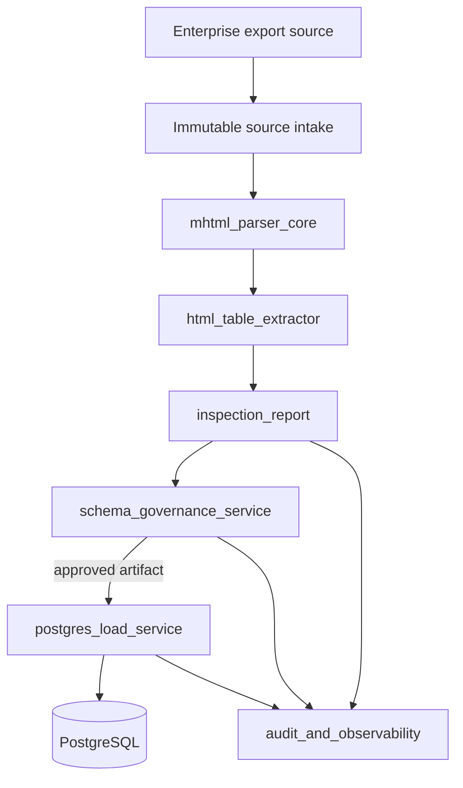
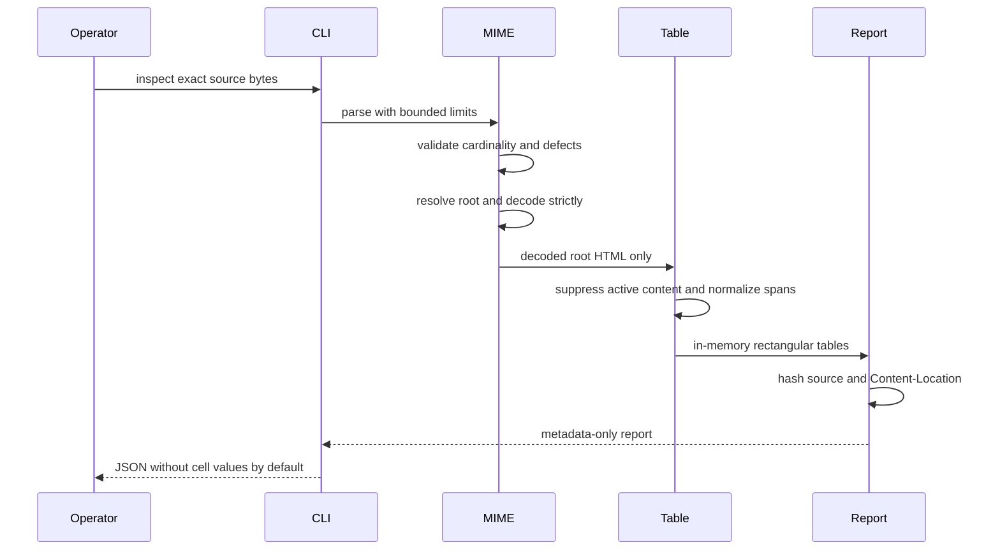

# Architecture

## System context

MHTML ETL Gateway is a modular ingestion boundary. The current package is a standalone deterministic inspector. Future services consume its evidence rather than re-parsing untrusted bytes independently.

## Current package modules

| Module | Responsibility | Side effects |
|---|---|---|
| `errors` | stable fail-closed error codes | none |
| `models` | immutable parser/report contracts and budgets | none |
| `mime_parser` | MIME validation, RFC 2387 root selection, strict decoding | file read only through file wrapper |
| `html_tables` | non-rendering table extraction and span normalization | none |
| `inspection` | source hash, protected location metadata, table summaries | none |
| `cli` | local JSON interface | stdout/stderr only |
| `hourly_product_gap` | deterministic GitHub single-flight preflight | evidence file reads and outputs |

## Deterministic data flow

## Privacy architecture

Raw MHTML and cell values stay in the protected data plane. The default control-plane artifact contains only cryptographic identity, dimensions, classifications, and fixed diagnostics. Raw Content-Location is hashed because file URIs can reveal internal usernames, drive letters, directories, and network topology. Header values use the same protected path as data rows and require explicit opt-in.

## Future deployment modes

### Embedded library

A caller imports `inspect_mhtml_bytes` and owns source custody, authorization, and storage.

### Single-node service

An API and worker share encrypted object storage and PostgreSQL, suitable for controlled internal operation.

### MSA deployment

Separate intake, parser, schema-governance, loader, audit, and connector services communicate with signed versioned artifacts. The parser service has no egress. Only the loader receives approved target schema and scoped database credentials.

## Ecosystem boundaries

- `.github` supplies central required workflows and guarded merge automation.
- `pg-erd-cloud` may visualize approved schema and lineage, never raw unapproved source values.
- `naruon` may receive authenticated job status and governed artifact references.
- `pg-llm-batch` and `contextual-orchestrator` may enrich or review post-extraction artifacts but cannot alter deterministic source evidence or bypass approval.

## Failure model

The parser fails closed on ambiguity and malformed structure. Nonfatal compatibility deviations are explicit diagnostics. A future loader uses resumable jobs but never marks a load complete until source, accepted, rejected, and target row counts reconcile.

## Compliance architecture

Control evidence is designed for NIST SSDF, OWASP ASVS, ISO/IEC 27001, CSAP readiness, and SOC 2 Trust Services Criteria. The repository does not claim certification; it produces auditable design, change, test, access, integrity, and incident evidence that can support an assessed service boundary.
