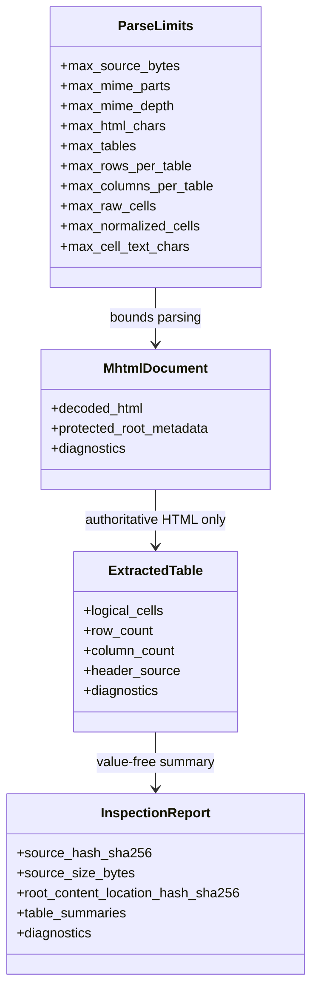
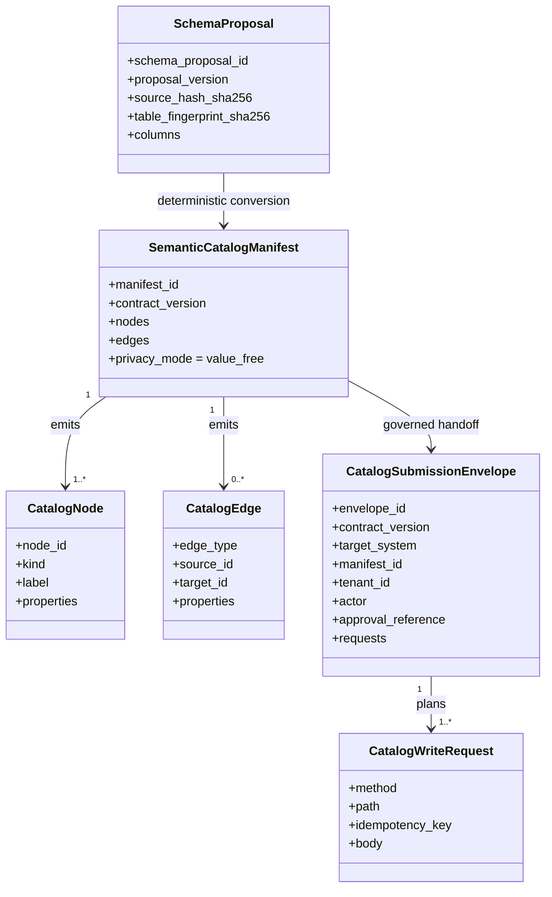
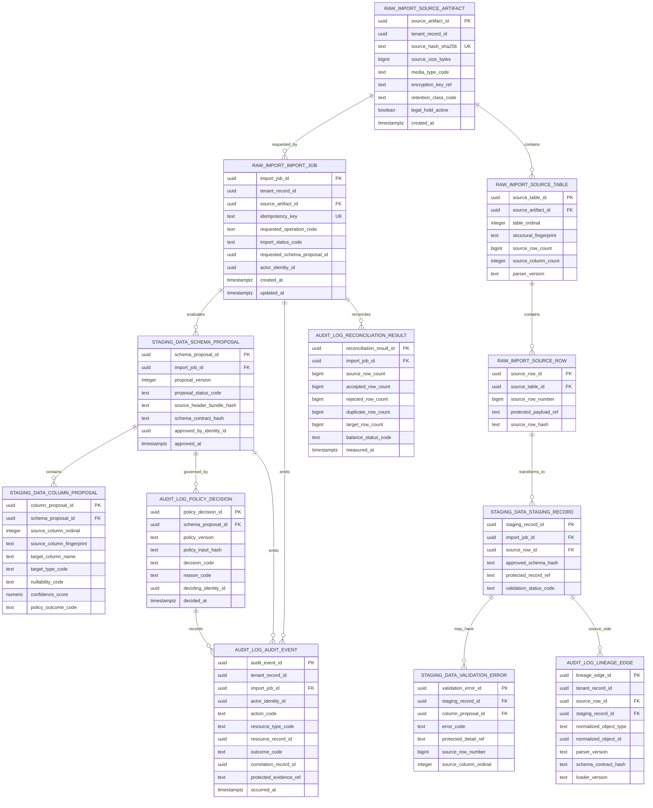
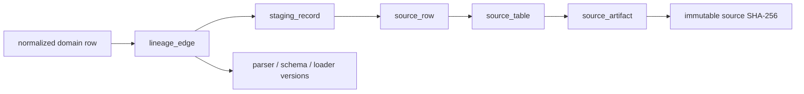

# Entity Relationship and Evidence Model

**Status:** Accepted model for current transactional artifact loads and future governed ingestion entities.
**Last reviewed:** 2026-08-09

This ERD intentionally separates **current in-memory inspection objects and
transactional dynamic load tables** from **future persisted ingestion control
entities**. The current loader creates the artifact catalog and caller-selected
business table; the future section is not evidence that staging migrations,
RLS policies, or an asynchronous service already exists.

## Current in-memory model

`MhtmlDocument` and `ExtractedTable` may contain protected values in process memory. `InspectionReport` intentionally does not serialize header or row values.

## Current value-free catalog handoff

This is an in-memory contract, not a database migration. The manifest can be
submitted by a caller to the Semantic Data Portal graph API only after the
caller performs authentication, tenant authorization, and steward approval.
The submission envelope is still a plan: remote acceptance is not represented.

## Future conceptual PostgreSQL ERD

The following entities are target architecture for governed ingestion. Schema names are shown as prefixes for clarity. All database objects must use descriptive two-or-more-word `snake_case` names.

## Generated normalized domain tables

`normalized_data` tables are **not** represented as one fixed generic table because their columns are created only from an approved schema artifact. Examples such as `inspection_document`, `customer_case_record`, or `quality_action_record` are illustrative domain names, not current migrations.

Every generated normalized row must expose an opaque row identifier and be reachable through `audit_log.lineage_edge`. The lineage edge carries version evidence; it does not copy protected business values into the audit schema.

## Tenant and authorization invariants

- Every persisted operational entity is tenant-bound directly or through a parent whose tenant is transactionally enforced.
- Natural SAP/customer identifiers are business values, never authorization keys.
- Cross-service external identifiers use RFC 9562 UUIDv7 but their timestamps have no authorization semantics.
- PostgreSQL RLS, service authorization, encryption, and protected views are planned enforcement layers and must be proven in migrations/tests before this document can classify them as implemented.
- Audit and lineage records may survive protected-payload retention expiry when policy allows, but must not retain the expired raw values themselves.

## Lineage invariant

A future `completed` import is invalid unless source, accepted, rejected, duplicate, and target counts reconcile under the approved load policy and every accepted normalized row has a complete lineage path.

## Migration acceptance for future persistence

Before any conceptual entity becomes an as-built table, the implementing PR must include: migration and rollback, tenant/RLS tests, constraints and indexes, transaction/concurrency tests, idempotent replay, protected-value/logging tests, lineage/reconciliation tests, backup/recovery impact, and an ADR or existing ADR mapping. This ERD must then be updated from conceptual to as-built status for the affected entities.
