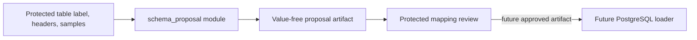

# Value-Free Schema Proposal Contract

**Version:** 1  
**Status:** Draft stacked implementation  
**Milestone:** M1 — Versioned schema governance

## Purpose

The schema proposal module converts protected table labels, protected source headers, and a bounded representative sample of protected values into a deterministic PostgreSQL proposal artifact. The artifact is safe for ordinary review surfaces because it contains no raw header or sample value.

This module **proposes only**. It does not execute DDL, open a database connection, fetch a resource, write a file, approve a mapping, or load a row. A human or policy-controlled protected workflow must approve a versioned proposal before a later loader can use it.

## Trust boundary



The protected input remains in process memory. Public output includes only:

- exact SHA-256 identities for the table label and source headers;
- an ordered table fingerprint;
- a proposal fingerprint binding policy, ordered evidence, names, types, counts, and review decisions;
- deterministic target table and column names;
- conservative PostgreSQL types;
- a nullable recommendation;
- bounded aggregate counts and maximum character length;
- fixed evidence and review codes;
- algorithm and policy versions.

Hashes can support equality correlation and therefore retain the source artifact's access and retention classification. They are not anonymous data.

## Python API

```python
from mhtml_etl_gateway.schema_proposal import (
    ColumnEvidence,
    SchemaProposalPolicy,
    propose_postgresql_schema,
)

proposal = propose_postgresql_schema(
    "SAP Inspection Export",
    (
        ColumnEvidence("MANDT", ("100", "200")),
        ColumnEvidence("DUEDT", ("20250131", "20250201")),
        ColumnEvidence("KUNNR", ("0012345678", "0098765432")),
    ),
    policy=SchemaProposalPolicy(),
)
```

`ColumnEvidence` requires an immutable tuple. Its `repr` is fixed and does not show the header or values. The module accepts no path, stream, database handle, URL, SQL text, model, or callback.

## Public artifact

A proposal serializes as:

```json
{
  "algorithm_version": "value_free_schema_proposal/1",
  "policy_version": "default/1",
  "source_table_label_sha256": "64 lowercase hexadecimal characters",
  "table_fingerprint_sha256": "64 lowercase hexadecimal characters",
  "proposal_fingerprint_sha256": "64 lowercase hexadecimal characters",
  "target_table_name": "sap_inspection_export",
  "column_count": 3,
  "columns": [
    {
      "source_header_sha256": "64 lowercase hexadecimal characters",
      "evidence_fingerprint_sha256": "64 lowercase hexadecimal characters",
      "target_column_name": "client_code",
      "proposed_postgresql_type": "text",
      "proposed_nullable": true,
      "sample_count": 2,
      "blank_count": 0,
      "nonblank_count": 2,
      "distinct_nonblank_count": 2,
      "maximum_value_characters": 3,
      "evidence_codes": ["identifier_semantics"],
      "review_required": false,
      "review_reasons": []
    }
  ]
}
```

The example values are structural illustrations. The public object has no `header`, `samples`, `values`, row payload, DDL, or sequential table identifier field.

## Identity model

### Exact source identity

The table label and each header use SHA-256 of their exact UTF-8 input. Unicode normalization is not applied to source identity.

### Table fingerprint

`table_fingerprint_sha256` binds:

- exact table-label hash;
- exact source-header hashes;
- source column order.

Changing column order changes the fingerprint and proposal mapping.

### Evidence fingerprint

Each column's `evidence_fingerprint_sha256` binds:

- exact source-header hash;
- ordered typed canonical sample hashes.

Typed canonicalization distinguishes null, boolean, integer, decimal, binary float, date, datetime, and Unicode string evidence. Raw canonical values are not serialized.

### Proposal fingerprint

`proposal_fingerprint_sha256` binds:

- algorithm version;
- complete policy payload and policy version;
- source and table identities;
- target names;
- conservative types;
- aggregate evidence;
- review flags and reasons;
- column order.

An evidence, order, policy, naming, type, or review change creates a new proposal identity.

## PostgreSQL naming policy

All target objects contain at least two words and use unquoted `snake_case`-compatible identifiers.

The normalizer:

- applies NFKC only to the derived target name, never source identity;
- splits camel case and acronym boundaries;
- preserves Unicode letters and numbers;
- replaces punctuation and whitespace with underscores;
- maps known enterprise headers such as `MANDT`, `GUID`, `DOCNOSUB`, `DUEDT`, and `KUNNR` to reviewed names;
- appends `_column` or `_record` when a source label has only one token;
- protects PostgreSQL reserved names;
- truncates at the configured UTF-8 byte limit with a content-derived hash suffix;
- resolves collisions with a content-derived hash suffix rather than a public sequential identifier;
- preserves source column order independently of generated-name order.

The default identifier byte limit is PostgreSQL's 63-byte default. Policy values below 16 bytes are rejected because they cannot preserve a meaningful prefix and collision suffix safely.

## Conservative type policy

Supported proposal types are:

- `text`;
- `boolean`;
- `date`;
- `bigint`;
- `numeric`.

### Text preservation

The module selects `text` when:

- the header has identifier semantics;
- any numeric-looking string has significant leading zeroes;
- values are ordinary text;
- values are mixed or unrecognized;
- a date-semantic header contains invalid date evidence;
- all evidence is blank;
- a datetime would lose time information if converted to `date`.

### Boolean

`boolean` requires either:

- exclusively native Python booleans; or
- a boolean-semantic header and values from the complete policy vocabulary.

Boolean words alone do not convert an unmarked status column optimistically.

### Date

`date` requires explicit date semantics in the header and every nonblank value to be either a native date or an exact string matching a configured date format. Datetime values do not downcast to dates.

### Big integer and numeric

`bigint` requires every nonblank value to be an exact integer and all values to fit signed 64-bit range. Identifier semantics and leading zeroes take precedence and retain `text`.

`numeric` is used for exact decimals, numeric strings, integers outside signed 64-bit range, and finite binary floats. Binary-float evidence and integer overflow require explicit review.

### Nullability

A representative sample cannot prove a `NOT NULL` invariant. The current module therefore always proposes `proposed_nullable: true` and records observed blank/nonblank counts separately. A later protected approval workflow can impose a constraint only with stronger source-system evidence.

## Review policy

`review_required` is true for at least:

- no nonblank evidence;
- mixed or unrecognized values;
- invalid values under explicit date semantics;
- integers outside signed 64-bit range;
- binary floating-point evidence.

Evidence codes can be informative without requiring review, such as identifier semantics, leading-zero preservation, exact boolean vocabulary, or complete valid date evidence.

## Resource limits

The policy independently bounds:

- total columns;
- samples per column;
- table-label and header characters;
- canonical value characters;
- target identifier bytes.

Very large integers are rejected by bit length before decimal conversion. Decimal digit counts and expanded fixed-point representation are bounded. Non-finite floats and decimals, bytes, containers, arbitrary objects, and callbacks are unsupported.

Expected failures use fixed `SchemaProposalErrorCode` values and fixed public messages. Protected labels and values never appear in the public error representation.

## Security invariants

- no raw header or sample value in `SchemaProposal.to_dict()`;
- fixed nonreflecting `ColumnEvidence.__repr__`;
- no DDL or SQL generation;
- no database, network, filesystem, model, or subprocess capability;
- deterministic output for identical ordered input and policy;
- no implicit stringification of arbitrary objects;
- no optimistic identifier-to-number conversion;
- no datetime-to-date truncation;
- no inference from unbounded evidence;
- no approval or loader authority.

## Test acceptance

The stacked implementation requires:

- realistic SAP-shaped identifiers and compact dates;
- Korean/Unicode names;
- camel case, reserved words, long names, collisions, and repeated headers;
- booleans, dates, integers, decimals, floats, nulls, mixed values, leading zeroes, and identifier semantics;
- order-, evidence-, and policy-sensitive fingerprints;
- fixed nonreflecting errors and repr;
- every resource boundary;
- static proof that the module contains no DDL, network, database, or file I/O path;
- 100% production statement coverage;
- 100% production branch coverage;
- 100% public docstrings;
- full repository tests on Python 3.11–3.14.

## Deliberate exclusions

This contract does not implement:

- raw table-row extraction artifacts;
- protected header display or mapping UI;
- human/policy approval persistence;
- PostgreSQL migrations or DDL;
- `COPY FROM STDIN`;
- rejection quarantine;
- row-level lineage;
- service APIs, tenancy, or authentication;
- LLM-assisted naming or type inference.

Those capabilities require separate ADRs and protected data-plane designs. The deterministic proposal remains independently useful as a standalone module and as an input to future `pg-erd-cloud` visualization or loader governance.
