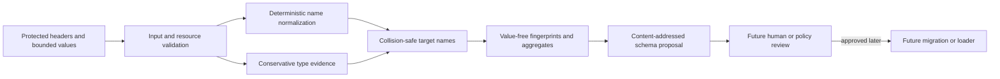

# Value-Free Schema Proposal Contract

**Version:** 1.0.0  
**Status:** Implemented library and local CLI slice
**Issue:** #4

## Purpose

The deterministic inspection layer proves table shape without exposing source values. The implemented proposal slice adds a reviewable PostgreSQL schema proposal: a protected in-process caller may supply headers and bounded representative values, or the local `propose` command may derive them from one validated MHTML table. The engine emits only fingerprints, normalized target names, conservative types, aggregate evidence, and explicit review reasons.

The proposal is not DDL. It does not connect to PostgreSQL, write a migration, fetch a resource, invoke an LLM, or persist source values.



## Trust boundary

`ProtectedColumnInput` is protected process memory. Its `header` and `values` may contain PII, customer identifiers, internal field names, document codes, and confidential business values. They never appear in `SchemaProposal.to_dict()` or error messages.

The local CLI is not an authenticated service. It must run inside an operator-controlled source-custody workflow with authorization, access, retention, and export controls. It emits only the value-free proposal; transport, approval, and persistence remain caller-owned.

## Python API

```python
from mhtml_etl_gateway.schema_proposal import (
    ProtectedColumnInput,
    SchemaProposalPolicy,
    propose_schema,
)

proposal = propose_schema(
    source_hash_sha256,
    (
        ProtectedColumnInput(
            header="DUEDT",
            values=("20250131", "20250201"),
            complete=True,
        ),
    ),
    policy=SchemaProposalPolicy(algorithm_version="1.0.0"),
)
```

For a complete local MHTML table, the first-party wrapper keeps protected
headers and rows in process memory and returns the same value-free contract:

```python
from mhtml_etl_gateway import propose_schema_from_mhtml

proposal = propose_schema_from_mhtml("export.mhtml")
```

The equivalent CLI output is one JSON object and follows RFC 8259's portable
structured-data interchange rules. Raw source values are not part of that
object.

### Inputs

- `source_hash_sha256`: exact SHA-256 identity of the immutable MHTML source.
- ordered `ProtectedColumnInput` values:
  - exact source header;
  - immutable tuple of bounded string or null evidence;
  - `complete=True` only when the values represent the complete source column rather than a sample.
- `SchemaProposalPolicy`:
  - algorithm version;
  - maximum column count;
  - maximum header characters;
  - maximum values per column;
  - maximum characters per value.

Every budget is a positive non-boolean integer. Validation failures use stable fixed-message `SchemaProposalError` values and never reflect protected input.

## Output

```json
{
  "schema_proposal_id": "schema_proposal_<32 hex characters>",
  "proposal_version": "1.0.0",
  "source_hash_sha256": "<64 hex characters>",
  "table_fingerprint_sha256": "<64 hex characters>",
  "columns": [
    {
      "source_header_hash_sha256": "<64 hex characters>",
      "target_column_name": "due_date",
      "proposed_type": "date",
      "nullable": false,
      "non_null_count": 2,
      "distinct_count": 2,
      "maximum_text_length": 8,
      "maximum_numeric_precision": null,
      "maximum_numeric_scale": null,
      "review_reasons": []
    }
  ]
}
```

The proposal contains no raw header, value, path, decoded HTML, or source location. `source_hash_sha256` and header fingerprints remain sensitive equality correlators and require access and retention controls.

## Naming policy

1. Preserve the exact source header only through SHA-256 identity.
2. Apply Unicode NFKC to the derived naming channel, never to source evidence.
3. Split acronym, camel, and Pascal boundaries.
4. Replace punctuation and whitespace with underscores and lowercase the result.
5. Use approved SAP aliases for the initial validated fields:
   - `MANDT` → `client_code`
   - `GUID` → `global_identifier`
   - `DOCNOSUB` → `document_subnumber`
   - `DUEDT` → `due_date`
   - `KUNNR` → `customer_number`
6. Prefix digit-leading names with `source_`.
7. Add `_field` to one-word and reserved names.
8. Use a content-derived opaque suffix for collisions; never use a sequential persistent identifier.
9. Preserve at least two words and remain within PostgreSQL's 63-byte identifier limit on a valid UTF-8 boundary.
10. Preserve document column order in the ordered proposal array.

## Type policy

The initial engine proposes only `text`, `boolean`, `date`, `bigint`, and `numeric`.

### Boolean

Automatic boolean evidence is limited to case-insensitive `true` and `false`,
and only when the protected header has no identifier semantics. Identifier
columns remain `text` with `identifier_semantics` even when every observed value
is boolean-shaped. Values such as `yes`, `no`, `Y`, `N`, `0`, and `1` remain
text unless a future versioned policy explicitly governs them.

Type semantics use the normalized but unfitted protected header name. Display
name truncation, collision suffixes, and PostgreSQL's byte limit cannot erase an
identifier or date signal before inference.

### Date

A date is proposed only when:

- every nonblank value is a valid `YYYY-MM-DD` or `YYYYMMDD` Gregorian date; and
- the normalized protected header contains date semantics; and
- identifier semantics do not conflict.

Date-shaped values without date semantics remain text with `date_semantics_missing`. Invalid calendar dates remain text with `mixed_or_unrecognized_values`.

### Integer and numeric

- Any signed integral portion with meaningful leading zeroes remains text with `leading_zero_identifier`.
- Headers with identifier semantics such as account, client, code, customer, document, GUID, ID, identifier, number, or subnumber remain text.
- Lossless integers within signed 64-bit range may become `bigint`; range
  checks compare protected digit strings without converting arbitrarily large
  values into Python integers.
- Larger integral values may become `numeric` with `bigint_range_exceeded`.
- Exact fixed-point decimal strings without identifier evidence may become `numeric`.
- Exponential notation, locale-formatted numbers, mixed values, and unsupported representations remain text.

### Nullability

- Any observed blank or null makes the proposal nullable.
- Sample-only evidence remains nullable and receives `sample_only_nullability` even when no null is observed.
- Only a complete column with no blanks may propose `nullable=false`.
- An empty or all-null column remains nullable text with `empty_column`.

## Deterministic identity

`table_fingerprint_sha256` hashes the ordered exact source-header fingerprints. Reordering columns changes the fingerprint.

`schema_proposal_id` hashes:

- proposal algorithm version;
- normalized source SHA-256;
- table fingerprint;
- ordered value-free column proposals.

Identical protected inputs and policy reproduce the same proposal. A policy-version change changes proposal identity even when decisions happen to remain equal.

## Review reasons

Current review reasons are:

- `sample_only_nullability`
- `empty_column`
- `identifier_semantics`
- `leading_zero_identifier`
- `date_semantics_missing`
- `bigint_range_exceeded`
- `mixed_or_unrecognized_values`

These are evidence labels, not permission to apply DDL automatically.

## Operational limits

The module is synchronous and in-memory. Callers must bound values before invocation and retain source custody. Future large-table profiling may add streaming aggregate evidence, but it must preserve proposal identity and nonreflection.

## Future approval and loading

A later schema-governance service will add:

- authenticated steward identity;
- proposal review state and immutable decisions;
- protected field-label display;
- type overrides with reasons;
- The current connector emits a value-free one-table DBML visualization plan
  for pg-erd-cloud. Multi-table relationships still require reviewed evidence.
- compatibility and schema-drift comparison;
- signed approved artifact;
- migration generation separated from execution;
- transactional loader reconciliation and rollback.

No current proposal is approved merely because it was generated successfully.
