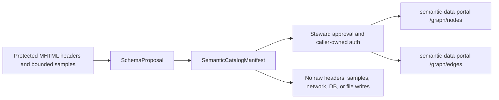

# Semantic Data Portal connector

## Purpose

The gateway now has a standalone connector boundary from a value-free
`SchemaProposal` to the graph-ingestion request shapes used by
`ContextualWisdomLab/semantic-data-portal`. This closes the buyer gap between
reviewing an MHTML-derived schema and making the approved structure discoverable
in a semantic catalog.

The connector is intentionally not an HTTP client. It returns a deterministic
manifest; an authenticated application-owned adapter decides when and how to
submit its `nodes` to `/graph/nodes` and its `edges` to `/graph/edges`.



## Python contract

```python
from mhtml_etl_gateway import build_semantic_catalog_manifest

manifest = build_semantic_catalog_manifest(
    proposal,
    catalog_name="SAP VOC export",
)
payload = manifest.to_dict()
```

The result contains:

- deterministic `manifest_id`, connector contract version, source SHA-256, and
  schema-proposal ID;
- one `dataset` graph node and one `column` node per proposed column;
- `contains_column` edges connecting the dataset node to its columns;
- proposal types, nullability, aggregate counts, review reasons, and header
  fingerprints only;
- endpoint paths that match the current Semantic Data Portal graph API.

The `catalog_name` is steward-provided display metadata. It is not copied from
protected sample values. The connector does not receive or reconstruct raw
headers: normalized target names and fingerprints come from the existing
value-free proposal contract.

## Security and operating boundary

The manifest is not an approval. A caller must perform authentication,
authorization, tenant selection, idempotency handling, retry policy, and
steward approval before submitting requests. The caller must attach the portal's
`actor` field and transport credentials at the final network boundary; neither
is persisted in this package's manifest.

The connector performs no database connection, DDL, LLM call, HTTP request,
filesystem write, browser rendering, or external-resource retrieval. It can be
embedded as a library or used by a future MSA connector service without changing
the deterministic parser path.

## Interoperability mapping

Semantic Data Portal's `dataset` and `column` nodes form a graph-native
representation. A future JSON-LD export may map the dataset node to DCAT 3
`dcat:Dataset`, its schema proposal to a versioned catalog record, and its
SHA-256 to a checksum/distribution identity. This slice keeps that mapping
explicit and local rather than claiming full DCAT serialization before a
governed catalog publisher exists.

## Evidence

- `tests/test_semantic_catalog_connector.py` verifies endpoint-compatible node
  and edge shapes, deterministic identity, order sensitivity, empty-schema
  behavior, validation, and absence of protected values.
- The full repository test suite remains at exactly 100% statement and branch
  coverage.
- Upstream API alignment was checked against the Semantic Data Portal
  `GraphNodeRequest` and `GraphEdgeRequest` contracts on 2026-08-11.

The governing decision is [ADR-0014](adr/0014-semantic-catalog-connector.md).
