# Technical Requirements Document: MHTML ETL Gateway

**Version:** 0.3
**Status:** Accepted implementation baseline with explicit future service boundaries
**Date:** 2026-08-11

## Runtime baseline

- Python: 3.11–3.14
- Runtime dependencies: none for the deterministic inspection slice
- PostgreSQL target baseline for future loading: PostgreSQL 18.4 or a supported deployment version with equivalent required behavior
- Packaging: PEP 517 wheel with PEP 561 typed-package marker
- Future external service and database identifiers: UUIDv7

## Trust boundaries

```mermaid
flowchart LR
    U[Untrusted MHTML bytes] --> B[Source budget and SHA-256]
    B --> M[MIME structure validator]
    M --> R[RFC 2387 root resolver]
    R --> D[Strict bounded HTML decoder]
    D --> T[Non-rendering table extractor]
    T --> P[Value-free inspection report]
    P --> S[Future protected schema proposal]
    S --> A[Human or policy approval]
    A --> L[Future transactional PostgreSQL loader]
```

Only exact source bytes cross into the parser. No browser, network, office, shell, XML entity, plugin, database, or external-resource capability exists in the parsing call graph.

## MIME validation requirements

The MIME layer shall:

- parse with the Python standard-library email parser under a deterministic policy;
- enforce `max_source_bytes` before parsing;
- convert standard-library recursion exhaustion into `mime_nesting_too_deep` rather than exposing `RecursionError`;
- traverse the parsed MIME tree iteratively after parsing;
- enforce `max_mime_depth` on every nested body entity;
- enforce `max_mime_parts` on all descendant body entities, including multipart containers;
- reject message-level and part-level parser defects;
- reject duplicate `Content-Type`, `Content-ID`, `Content-Location`, and `Content-Transfer-Encoding` headers;
- reject duplicate normalized `Content-ID` values across all descendant body entities;
- inspect raw top-level Content-Type parameters before structured parsing and reject repeated `boundary`, `start`, or `type` names;
- parse raw parameter delimiters without splitting quoted strings or comments;
- never use Content-Location as retrieval authority.

Unknown Content-Transfer-Encoding values form a narrow compatibility lane: payload bytes are treated as identity data and a fixed diagnostic is emitted. This exception does not relax duplicate-header, count/depth, root-selection, decoding, or nonreflection controls.

## RFC 2387 root requirements

- Standalone non-multipart `text/html` is a valid root.
- Other top-level media types fail.
- When `start` is present, matching uses normalized Content-ID across all descendant body entities.
- Zero matches fails with `missing_html_root`.
- More than one match fails with `ambiguous_html_root` before media-type validation.
- A unique multipart or non-HTML match fails.
- When `start` is absent, the first direct body part is the root; neither a later HTML part nor a nested HTML leaf may be substituted.
- A present `type` parameter must match the selected root media type.
- A missing `type` is accepted only with a `missing_related_type` diagnostic because observed enterprise exports omit it despite the normative RFC requirement.

## Decoding requirements

1. use a declared registered charset when present;
2. otherwise detect UTF-32, UTF-8, or UTF-16 BOM in deterministic order;
3. otherwise decode strict UTF-8;
4. reject unknown charset names and byte/charset mismatches;
5. enforce `max_html_chars` immediately after strict decoding and before table parsing;
6. keep public errors fixed and nonreflecting.

## HTML table requirements

The `HTMLParser`-based extractor shall:

- collect only top-level tables;
- reject nested tables until an explicit domain flattening policy exists;
- treat `script`, `style`, `noscript`, `template`, `iframe`, and `object` as inert container regions;
- ignore the void `embed` element and its attributes without suppressing following text;
- preserve exact nested suppression boundaries so a mismatched closing tag cannot expose enclosed content;
- ignore resource-bearing attributes and non-table structures;
- normalize whitespace and block/line-break separators deterministically;
- reject duplicate `rowspan` or `colspan` attributes case-insensitively;
- reject missing-value, non-integer, non-positive, overlapping, or inconsistent span geometry;
- bound raw source-cell construction before allocating the next `_RawCell`;
- project normalized row/column/cell shape and reject oversized expansion before allocating logical cells;
- expand valid `rowspan` and `colspan` into a rectangular grid;
- account for implicit rows and cells against the same document-wide budgets as explicit input;
- distinguish semantic `th` headers from positional first-row headers.

## Public inspection contract

The public report contains only:

- `source_hash_sha256`;
- `source_size_bytes`;
- `root_content_location_hash_sha256` or null;
- fixed document diagnostics;
- table count and document order;
- per-table row count, data-row count, column count, selected header-row coordinate, header-source classification, header-value count, and fixed diagnostics.

It does not contain table identifiers, decoded HTML, data rows, header values, raw Content-ID or Content-Location, Content-Location scheme, source-controlled media type, charset, transfer encoding, resource payload, or local path.

The Python API and CLI provide no header-value option. Future schema governance must access headers through a separate authenticated source-custody contract with authorization, audit, protected output, retention, and export controls.

## Error and nonreflection requirements

Every expected failure raises `MhtmlGatewayError` with a stable `ErrorCode`. Public serialization exposes only the code and its approved fixed message. Caller-supplied details, configured limits, source paths, MIME metadata, headers, cells, and payload text must never appear in public errors or diagnostics.

Argparse failures and invalid `ParseLimits` construction map to `invalid_argument`. Unexpected programming exceptions are not reclassified as user errors.

## Future PostgreSQL requirements

The loader architecture shall use separate `raw_import`, `staging_data`, `normalized_data`, and `audit_log` schemas. Every object name contains at least two lowercase `snake_case` words and fits PostgreSQL's 63-byte unquoted-identifier limit. Single-token generated columns and tables receive `_field` and `_table` suffixes respectively; direct unsafe identifiers fail closed. Loads use explicit transactions and streamed `COPY FROM STDIN`; dynamic identifiers are selected only from an approved schema artifact and never concatenated from source text. Legacy catalog `status` is renamed to `load_status_code` by a constant replay-safe migration.

## Semantic catalog connector requirements

The `semantic_catalog_connector` module shall:

- accept only an existing `SchemaProposal` plus steward-provided catalog display
  metadata;
- emit deterministic dataset/column nodes and `contains_column` edges matching
  the Semantic Data Portal graph request contract;
- include source/proposal fingerprints, aggregate evidence, nullability, types,
  and review reasons, but no raw headers or sample values;
- derive a stable manifest ID from the contract version and canonical payload;
- perform no network request, database operation, file write, LLM call, or
  approval decision;
- leave actor identity, authentication, tenant authorization, retry, and
  transport to a caller-owned boundary;
- remain importable as a standalone Python library and composable as an MSA
  module.

The `semantic_catalog_handoff` module shall:

- require bounded tenant and approval references plus an explicit actor;
- add the actor field to each portal node/edge request body;
- emit stable per-request idempotency keys and a governance-context-bound
  envelope ID;
- keep tenant and approval references at the handoff boundary rather than in
  graph-node properties;
- perform no credential binding, approval decision, HTTP request, retry,
  persistence, database operation, or LLM call.

## Autonomous-development requirements

- the repository-owned gate runs only after secret isolation is installed;
- gate code receives only the non-secret `NVIDIA_NIM_API_KEY_CONFIGURED` marker;
- repository code executes under a dedicated unprivileged identity and `cwl-workspace` group;
- a blocked PR action does not terminate the invocation while independent work exists;
- review or check latency yields to the next executable item;
- a proven-disjoint buyer-visible slice may create at most one additional draft PR per invocation after PR repairs and shared blockers are exhausted;
- local automation never approves, enables auto-merge, merges, tags, publishes, or releases.

## Quality requirements

- 100% production statement coverage;
- 100% production branch coverage;
- 100% public API docstrings;
- compileall, repository-contract, wheel-build, and installed-wheel smoke checks;
- full-SHA GitHub Action pinning;
- the hash-locked `pytest` runner executes every repository-owned quality contract test;
- agent-branch pushes materialize exact-head quality evidence without duplicating a same-SHA PR run;
- no customer-like `.mhtml` or `.mht` artifact is committed;
- current-head central review, security, unresolved-thread, branch-freshness, and merge policy remain authoritative.
