# Technical Requirements Document: MHTML ETL Gateway

**Version:** 0.1
**Status:** Accepted implementation baseline
**Date:** 2026-08-07

## Runtime baseline

- Python: 3.11–3.14
- Runtime dependencies: none for the deterministic inspection slice
- PostgreSQL target baseline for later loading: 18.4 or a supported deployment version with equivalent required behavior
- Packaging: PEP 517 wheel, typed package marker
- IDs in future service/database contracts: UUIDv7

## Trust boundaries

```mermaid
flowchart LR
    U[Untrusted MHTML bytes] --> B[Source budget and SHA-256]
    B --> M[MIME structure validator]
    M --> R[RFC 2387 root resolver]
    R --> D[Strict HTML decoder]
    D --> T[Non-rendering table extractor]
    T --> P[Privacy-preserving inspection report]
    P --> S[Future schema proposal]
    S --> A[Human or policy approval]
    A --> L[Future transactional PostgreSQL loader]
```

Only exact source bytes cross into the parser. No browser, network, office, shell, XML entity, or plugin capability exists in the parsing call graph.

## MIME validation requirements

The MIME layer shall:

- parse with the Python standard-library email parser under a deterministic policy;
- enforce `max_source_bytes` before parsing;
- reject message-level or part-level parser defects;
- reject duplicate `Content-Type`, `Content-ID`, `Content-Location`, and `Content-Transfer-Encoding` headers;
- inspect raw top-level Content-Type parameters before structured parsing and reject repeated `boundary`, `start`, or `type` names;
- parse raw parameter delimiters without splitting quoted strings or comments;
- bound the number of leaf MIME parts;
- never use Content-Location as retrieval authority.

Unknown Content-Transfer-Encoding values form a narrow compatibility lane: payload bytes are treated as identity data and a generic diagnostic is emitted. This exception does not relax duplicate-header checks or root-selection metadata validation.

## RFC 2387 root requirements

- Standalone non-multipart `text/html` is a valid root.
- Other top-level media types fail.
- When `start` is present, matching uses normalized Content-ID across all leaf parts.
- Zero matches fails with `missing_html_root`.
- More than one match fails with `ambiguous_html_root`.
- A unique non-HTML match fails.
- When `start` is absent, the first body part is the root; a later HTML part must never be substituted.
- A present `type` parameter must match the selected root media type.
- A missing `type` is accepted only with `missing_related_type` diagnostic because observed enterprise exports omit it despite the normative RFC requirement.

## Decoding requirements

1. use a declared registered charset when present;
2. otherwise detect UTF-32, UTF-8, or UTF-16 BOM in deterministic order;
3. otherwise decode strict UTF-8;
4. reject unknown charset names and byte/charset mismatches;
5. keep errors generic and nonreflecting.

## HTML table requirements

The `HTMLParser`-based extractor shall:

- collect only top-level tables;
- reject nested tables until an explicit domain flattening policy exists;
- treat `script`, `style`, `noscript`, and `template` as inert suppression regions;
- ignore resource-bearing attributes and non-table structures;
- normalize whitespace and block/line-break separators deterministically;
- reject invalid non-positive span values;
- expand `rowspan` and `colspan` without overlap;
- pad irregular rows to a rectangular grid;
- account for implicit rows/cells against the same budgets as explicit input;
- distinguish semantic `th` headers from positional first-row headers.

## Public inspection contract

Default output contains:

- `source_hash_sha256`;
- `source_size_bytes`;
- `root_content_type`;
- `root_content_location_scheme`;
- `root_content_location_hash_sha256`;
- document diagnostics;
- table count;
- per-table dimensions, selected header coordinate/source, header count, inclusion flag, and diagnostics.

Default `headers` is always empty. `include_header_values=True` is an explicit trusted-operator option. Data rows are never serialized by the inspection contract.

## Nonreflection requirements

Public errors and default reports must not expose raw source paths, Content-ID, Content-Location, charset, transfer-encoding, declared related type, header values, row values, embedded payloads, or active-content text. Diagnostics use stable codes and fixed explanatory text.

## Future PostgreSQL requirements

The loader architecture shall use separate `raw_import`, `staging_data`, `normalized_data`, and `audit_log` schemas. Every object name contains at least two words and is preferably `snake_case`. Loads use explicit transactions and streamed `COPY FROM STDIN`; dynamic identifiers are selected only from an approved schema artifact, never concatenated from source text.

## Quality requirements

- 100% production statement coverage;
- 100% production branch coverage;
- 100% public API docstrings;
- compileall, repository-contract, wheel-build, and installed-wheel smoke checks;
- full-SHA action pinning;
- no customer-like `.mhtml` or `.mht` committed;
- current-head central review, security, and merge policy.
