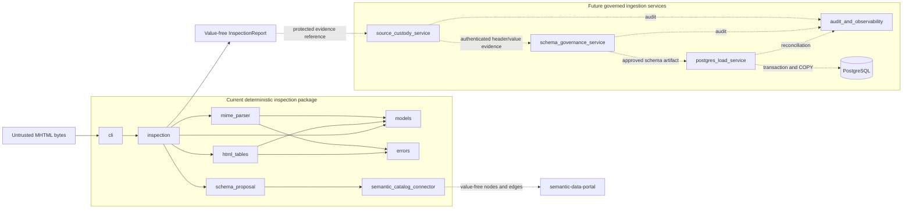
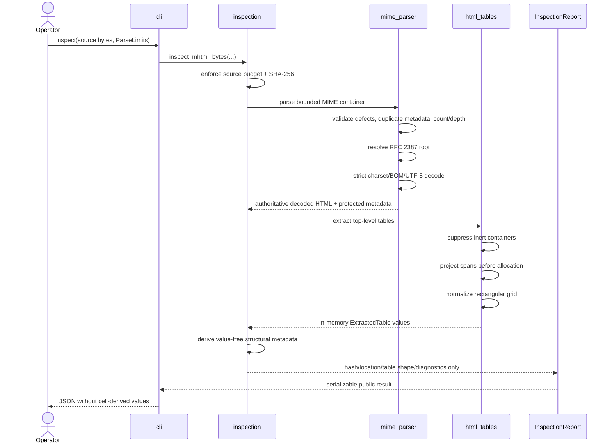
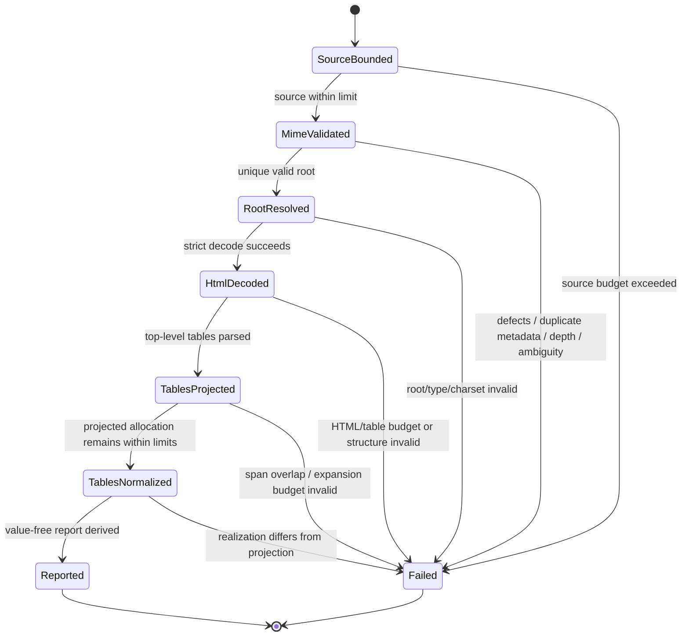
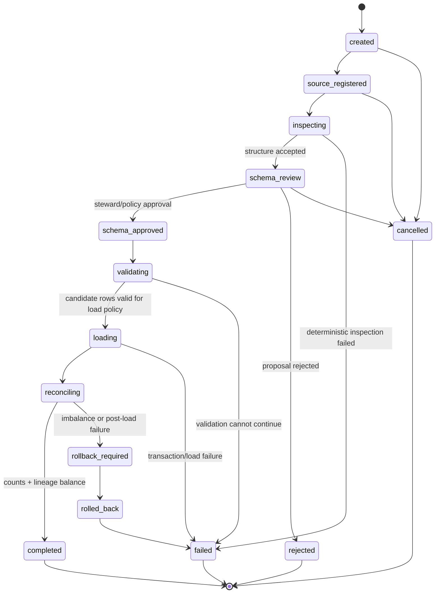
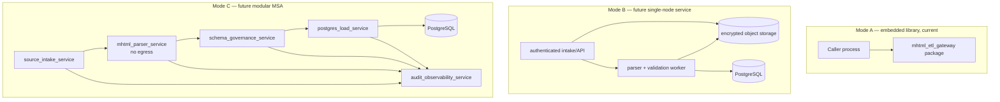
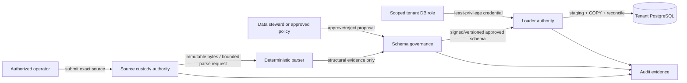

# UML and Runtime Views

**Status:** Accepted documentation baseline for the current inspection and
value-free catalog-handoff slices; persisted ingestion boundaries remain future.
**Last reviewed:** 2026-08-11

This document is the canonical diagram-as-code view of MHTML ETL Gateway. A box labelled **future** is target architecture, not a claim that the component is implemented or deployable today. Current production behavior includes value-free schema proposals and a caller-owned Semantic Data Portal manifest handoff; persisted ingestion services remain future.

## Component view

### Boundary rules

- Current parser code has no browser, JavaScript, network fetch, Office runtime, XML external-entity, shell, database, or connector capability.
- Header/value disclosure is not added to `InspectionReport`; future schema work uses a separate authenticated source-custody boundary.
- The future loader accepts only an approved, versioned schema artifact and scoped database authorization.
- `pg-erd-cloud`, naruon, pg-llm-batch, and contextual-orchestrator are downstream/optional integration ports, not hidden runtime dependencies of the parser.

## Inspection sequence

## Current parser state view

`Failed` represents a stable `MhtmlGatewayError` code for expected input failures. Unexpected programming defects remain defects; they are not rewritten into successful or ambiguous results.

## Future import-job state view

The following lifecycle is **conceptual P1-P3 target architecture**. No current persisted `import_job` table or service state machine is claimed.

A future implementation must make every transition idempotent or transactionally guarded, retain the exact source/mapping/parser/loader versions, and never mark `completed` while reconciliation is unbalanced.

## Deployment view

## Authority flow

No LLM, downstream service, or visualization tool may promote an unapproved proposal into loader authority. Future AI assistance may explain or review evidence but cannot mutate immutable source identity or bypass deterministic validation and schema approval.

## Diagram maintenance contract

Update this file when a material component, authority boundary, externally visible lifecycle, or deployment topology changes. Corresponding ADR, PRD/TRD, data model, API contract, threat model, tests, and CHANGELOG must be reconciled in the same change when affected.
