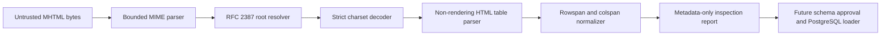

# Deterministic MHTML Parser and Inspection Slice Design

**Status:** Approved implementation baseline
**Date:** 2026-08-07
**Repository:** `ContextualWisdomLab/mhtml-etl-gateway`

## Problem

Enterprise exports from SAP ALV, Excel Web Archive, and browsers encode tables inside MHTML (`multipart/related`). Loading them directly into PostgreSQL without first proving which MIME part is authoritative, how HTML tables are normalized, and which source bytes produced each result makes the pipeline unauditable and unsafe.

The first product slice must therefore create a deterministic, non-rendering inspection boundary. It accepts untrusted MHTML bytes, resolves the root HTML part, extracts bounded tabular structure, and emits metadata-only JSON suitable for schema review. It does not execute active content, fetch external resources, or expose any cell-derived values by default.

## Product Outcome

A data engineer can run:

```bash
python -m mhtml_etl_gateway inspect export.mhtml --pretty
```

and receive a stable report containing the source SHA-256, source byte size, selected root part, table dimensions, protected header metadata, and diagnostics. The report is safe to attach to an issue or schema-approval workflow because it excludes data rows and embedded resource payloads.

## Architecture



### Module boundaries

- `errors.py`: stable error codes and fail-closed exception type.
- `models.py`: immutable limits, parsed-document, table, diagnostic, and report contracts.
- `mime_parser.py`: source-size enforcement, MIME parsing, root selection, and strict decoding.
- `html_tables.py`: bounded HTML parsing and rectangular table normalization.
- `inspection.py`: source hashing and metadata-only report assembly.
- `cli.py` / `__main__.py`: deterministic command-line interface.

Every module is independently testable and has no runtime dependency outside the Python standard library.

## MIME behavior

1. Reject a source that exceeds `ParseLimits.max_source_bytes` before MIME parsing.
2. Accept `multipart/related` and standalone `text/html` messages.
3. For `multipart/related`, prefer the part named by the `start` parameter after normalizing angle brackets around `Content-ID`.
4. When `start` is absent, use the first body part exactly; reject it when it is not `text/html`.
5. Reject MIME parser defects, duplicate critical headers/parameters, missing, ambiguous, non-HTML, or undecodable roots.
6. Validate a present RFC 2387 `type`; diagnose a missing type as an observed enterprise compatibility deviation.
7. Treat unknown `Content-Transfer-Encoding` as identity only when Python's MIME parser returns bytes; record a diagnostic rather than silently claiming standards compliance.
8. Never resolve `Content-Location`, `cid:`, or network resources.

## HTML table behavior

1. Parse with `html.parser.HTMLParser`; no browser, JavaScript engine, CSS engine, XML external entity resolver, or network client exists in the runtime path.
2. Ignore text and attributes from `script`, `style`, `noscript`, `template`, and media/resource elements.
3. Convert `<br>` to a newline and normalize other whitespace deterministically.
4. Expand `rowspan` and `colspan` into a rectangular grid.
5. Reject nested tables in this first release because flattening them without a domain rule is ambiguous.
6. Enforce limits for HTML characters, table count, rows, columns, total cells, and cell text characters.
7. Infer headers from the first non-empty row. If the row contains no `<th>`, report a diagnostic that the header is positional rather than semantically declared.
8. Never place data-row or header values in the default inspection report; header text requires explicit protected opt-in.

## Security and PII posture

PII is not masked in the transformation engine because masking can destroy operational meaning. Instead:

- raw artifacts remain encrypted and access-controlled in the future storage layer;
- the inspection report is metadata-only by default, hashes raw Content-Location, and omits header values;
- row-level data export requires an explicit later capability;
- every artifact is identified by SHA-256 and connected to lineage;
- retention, tenant isolation, least privilege, purpose limitation, and immutable audit replace indiscriminate masking;
- active content and external resource retrieval are structurally absent.

## Error handling

All expected failures raise `MhtmlGatewayError` with a stable `ErrorCode`. The CLI writes one JSON error object to standard error and exits with status 2. Unexpected exceptions are not converted into success-shaped results.

## Test strategy

Tests use synthetic fixtures only; the uploaded enterprise sample is never committed. Required cases include:

- RFC 2387 `start` root selection;
- standalone HTML input;
- Korean UTF-8 text;
- malformed MIME and unknown charset;
- rich cells containing data-URI images without payload leakage;
- ignored script/style/template content;
- rowspan/colspan normalization;
- nested-table rejection;
- every resource limit;
- deterministic CLI output and error output;
- metadata-only report contract;
- public API docstring coverage;
- a local, noncommitted smoke test against the supplied sample asserting one table, 40 columns, and 13 data rows.

Production statement and branch coverage must both be 100% on the exact PR head.

## Future slices

This slice deliberately does not perform schema inference or PostgreSQL writes. Its contracts feed the next slices:

1. versioned schema proposal and approval;
2. raw/staging/normalized PostgreSQL migrations;
3. transaction-safe `COPY FROM STDIN` loading;
4. row-level lineage and reconciliation;
5. worker/API deployment and operational telemetry;
6. naruon and pg-erd-cloud connector contracts.
