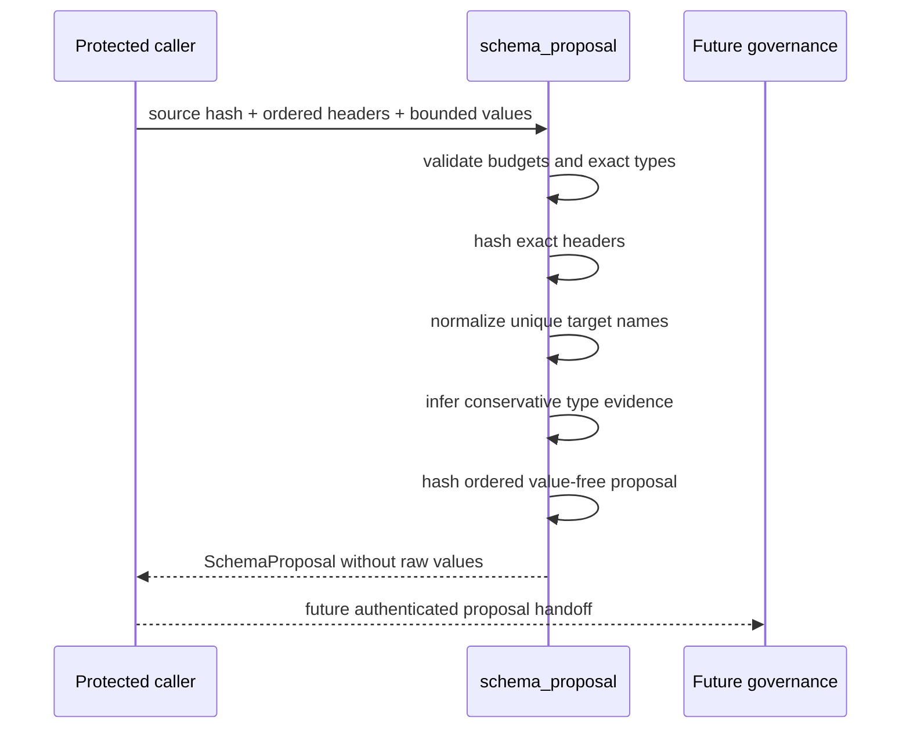

# Value-Free Schema Proposal Design

**Status:** Implemented draft slice  
**Date:** 2026-08-09  
**Issue:** #4

## Problem

The parser can inspect protected MHTML safely but does not yet provide a governed bridge to PostgreSQL design. Data engineers need an ordered proposal that is deterministic, conservative, reviewable, and safe to move between systems without copying headers or row values.

## Considered approaches

### Direct DDL from source headers

Rejected. It gives untrusted source text mutation authority, creates schema-injection and irreversible type-coercion risk, and provides no reviewed intermediate artifact.

### Public header export followed by an external mapper

Rejected. A CLI boolean is not authorization. Header output can be redirected into logs or tickets and breaks the public value-free inspection contract.

### Protected in-process proposal artifact

Selected. The caller keeps values inside its source-custody boundary; the module emits hashes, derived names, aggregate evidence, review reasons, and content-addressed identity only.

## Data flow

## Public contracts

- `PostgresType`
- `SchemaProposalErrorCode`
- `SchemaProposalError`
- `SchemaProposalPolicy`
- `ProtectedColumnInput`
- `ColumnProposal`
- `SchemaProposal`
- `propose_schema`

The module is imported explicitly and is not exposed through the package-root convenience API or CLI in this slice.

## Naming algorithm

1. Hash the exact source header as UTF-8.
2. Apply NFKC only to the derived naming channel.
3. Use approved exact SAP aliases when present.
4. Split acronym and camel/Pascal boundaries.
5. Convert punctuation/whitespace to `_`, collapse repeats, and lowercase.
6. Use an opaque `source_field_<hash>` fallback for empty or non-word labels.
7. Prefix digit-leading names with `source_`.
8. Add `_field` to single-word and reserved names.
9. Fit the identifier into 63 UTF-8 bytes while preserving the final token.
10. Resolve collisions with an opaque hash derived from exact header and ordered position.

## Type algorithm

1. Trim evidence; blanks become null evidence.
2. Empty/all-null columns become nullable `text`.
3. Exact case-insensitive `true`/`false` becomes `boolean`.
4. Valid ISO or compact dates become `date` only with date semantics and no identifier conflict.
5. Leading-zero or identifier-semantic numeric shapes remain `text`.
6. Signed 64-bit integers become `bigint`.
7. Larger integers become `numeric` with review evidence.
8. Fixed-point decimal strings become `numeric` when no identifier conflict exists.
9. Everything else remains `text` with an explicit reason.
10. Sample-only evidence remains nullable regardless of observed null count.

## Identity

The table fingerprint hashes the ordered exact header hashes. The proposal ID hashes the version, source hash, table fingerprint, and ordered serialized column proposals. No raw value participates in serialized output, but every protected value influences aggregate evidence and therefore may influence proposal identity.

## Security properties

- fixed nonreflecting validation errors;
- no raw values in `to_dict()`;
- no DDL or database connection;
- no file or network operation;
- no model call;
- bounded columns, header length, sample count, and value length;
- immutable input/output dataclasses;
- content-addressed provenance;
- conservative abstention through `text` and review reasons.

## Test strategy

Tests cover:

- realistic SAP names and codes;
- Korean and compatibility Unicode labels;
- acronym/camel naming;
- reserved, digit-leading, empty, emoji, long UTF-8, and colliding labels;
- exact booleans;
- valid/invalid compact and ISO dates;
- leading-zero IDs;
- bigint boundary and overflow;
- decimal precision and scale;
- mixed/empty/sample-only evidence;
- deterministic and order-sensitive identity;
- raw-value nonreflection;
- fixed errors and all resource budgets;
- absence of DDL, database, process, network, and fetch dependencies;
- exact production statement, branch, and public-docstring coverage.

## Deferred work

- authenticated proposal service and stewardship UI;
- protected display of source labels;
- policy-backed type overrides;
- schema-drift comparison;
- approved artifact signatures;
- pg-erd-cloud connector;
- migration generation;
- PostgreSQL execution and reconciliation.
